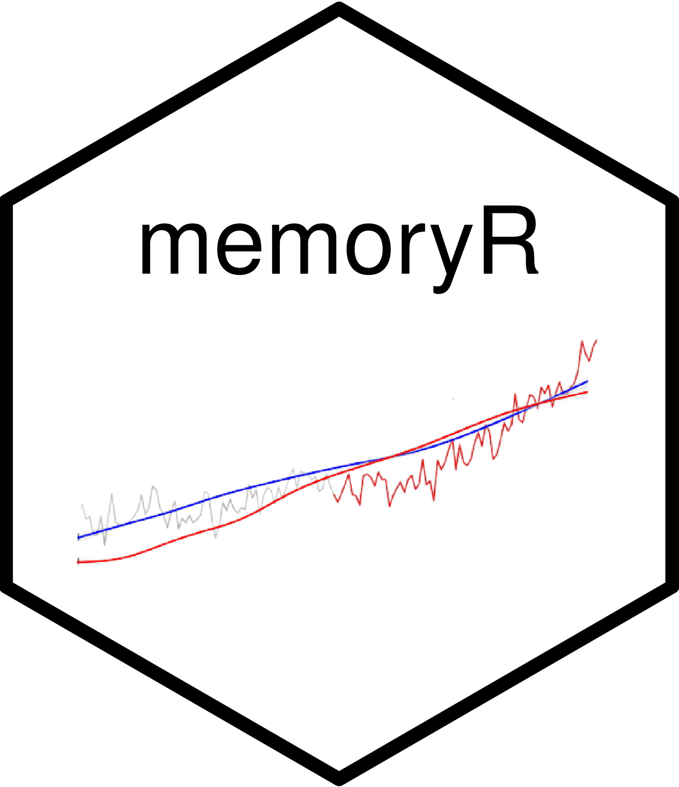

<!-- README.md is generated from README.Rmd. Please edit that file -->

```{r, include = FALSE}
knitr::opts_chunk$set(
  collapse = TRUE,
  comment = "#>",
  fig.path = "man/figures/README-",
  out.width = "100%"
)
```

# memoryR 

<!-- badges: start -->

[](https://www.tidyverse.org/lifecycle/#experimental)
[](https://cran.r-project.org/web/licenses/MIT)
<!-- badges: end -->

The goal of memoryR is to provide functions for the project *Memory polarization over visual evidence of climate change*. 

## Installation

You can install the development version of memoryR from [GitHub](https://github.com/) with:

``` r
# install.packages("devtools")
devtools::install_github("andr3wli/memoryR")
```

## Example

This is the workflow to get clean data for the analysis: 

```{r eval=FALSE}
library(memoryR)
# 1: data cleaning for the petition data set: clean_petition()
mturk_path <- "data/mturkcode.csv"
analysis_path <- "data/petition.csv"
attention_question <- "This is an attention check. Please select ‘strongly agree’ to pass this check. You will not be compensated if you fail this check."

petition <- clean_analysis(path1 = mturk_path, path2 = analysis_path, question = attention_question)

# 2: data cleaning for the redraw data set: redraw_clean_data()
draw_path <- "data/draw_xyt.csv"
redraw <-redraw_clean_data(draw_path, discard_data = petition$MTurk)

# 3: add political orientation to the redraw data set 
redraw_with_poli <- add_politics_col(analysis_data = petition, redraw_data = redraw)

# 4: now turn the data from step 3 into something tidy and clean: tidy_redraw_data()
foo <- tidy_redraw_data(data = redraw_with_poli)

# 5: tidy the data (this is the last step before we get clean and workable redraw data)
clean_data <- make_clean_redraw(foo)

readr::write_csv(clean_data, file = here::here("data", "clean_data.csv"))
```

From here, use the `clean_data` data set to create the plots:

```{r eval=FALSE}
# preamble stuff
img <- "img/image024.jpg"

#1: preamble stuff before creating the plots: create the new data set and load the image path
clean_data <- clean_for_plot(clean_data)

#2: create the whole plot   
whole_plot(img_path = img, df = df_for_plots)

#2: create the half plots 
half_plot(img_path = img, df = df_for_plots, type = "rise")
half_plot(img_path = img, df = df_for_plots, type = "flat")

```

Lastly, use the `clean_data` for the data analysis cleaning:

```{r eval=FALSE}
#1: add the salient column 
stats_df <- add_salient_col(df = clean_data)

f <- flat_data(df = stats_df)
r <- rise_data(df = stats_df)

full <- rbind(f, r)
```


